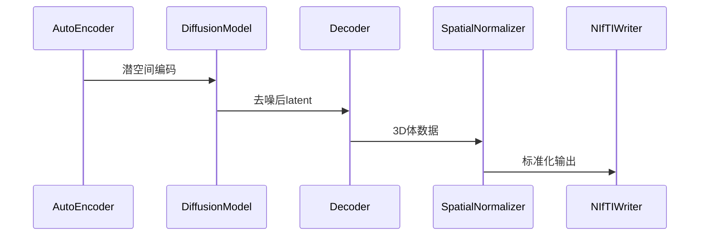
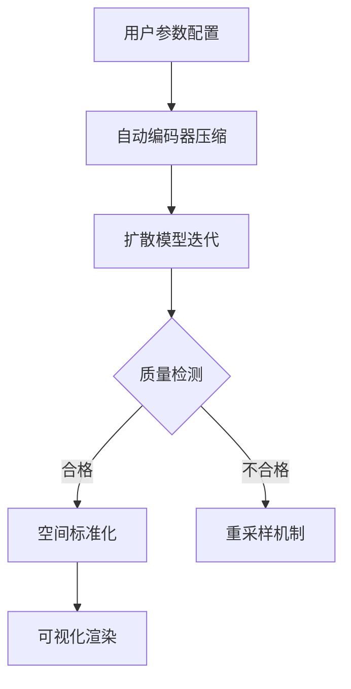
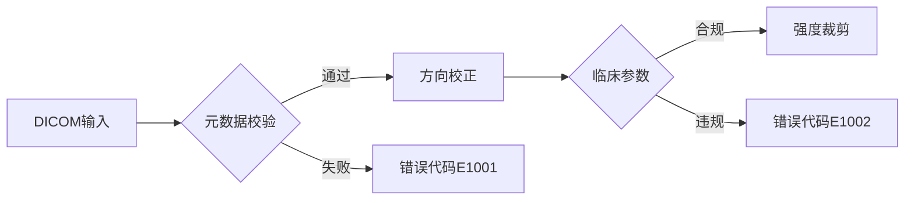

# 脑部MRI生成系统设计报告

## 系统技术架构

### 核心模块交互流程


**三层架构设计**:
1. **数据层**：DICOM/NIfTI格式转换模块
2. **模型层**：
   - 自动编码器：潜空间映射（3D→latent）
   - 扩散模型：50步迭代去噪
   - 解码器：latent→3D体数据
3. **应用层**：可视化渲染与增强处理

### 模块调用时序


## 应用场景扩展

### 医疗诊断辅助场景
- **病理模拟**：
  - 肿瘤生长模式参数化生成
  - 脑室扩张动态演变模拟
  - 白质病变区域变异生成

## 增强型业务流程



## 配置参数详解

### inference.json核心参数
| 参数名 | 类型 | 范围 | 默认值 | 说明 |
|--------|------|------|--------|-----|
| sampling_steps | int | [10,100] | 50 | 去噪迭代次数 |
| guidance_scale | float | [1.0,10.0] | 7.5 | 条件控制强度 |
| output_resolution | string | 192^3/256^3 | 192^3 | 输出体数据维度 |

## 错误处理机制

### DICOM转换质量控制


### 错误代码表
| 代码 | 触发条件 | 处理策略 |
|------|----------|----------|
| E1001 | Modality≠MR | 终止流程，记录日志 |
| E1002 | 脑体积<900ml | 触发自动重采样 |

## 性能优化策略

### 混合精度训练配置
```json
{
  "amp": {
    "enabled": true,
    "dtype": "fp16",
    "grad_scaler": {
      "growth_interval": 2000
    }
  }
}
```